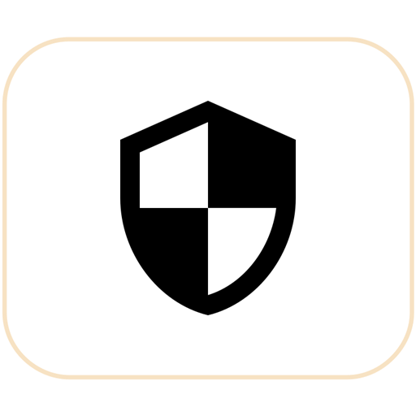
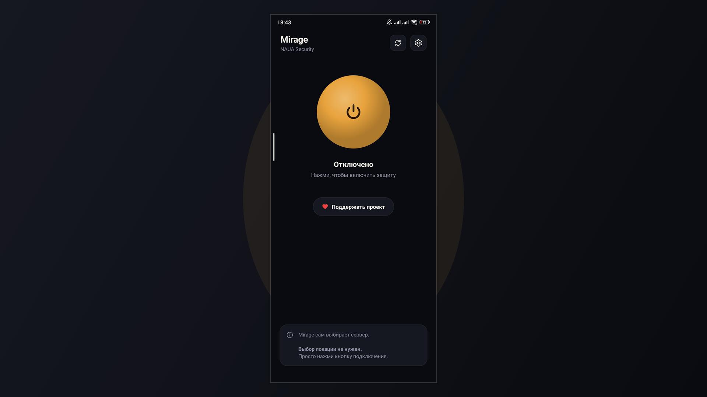
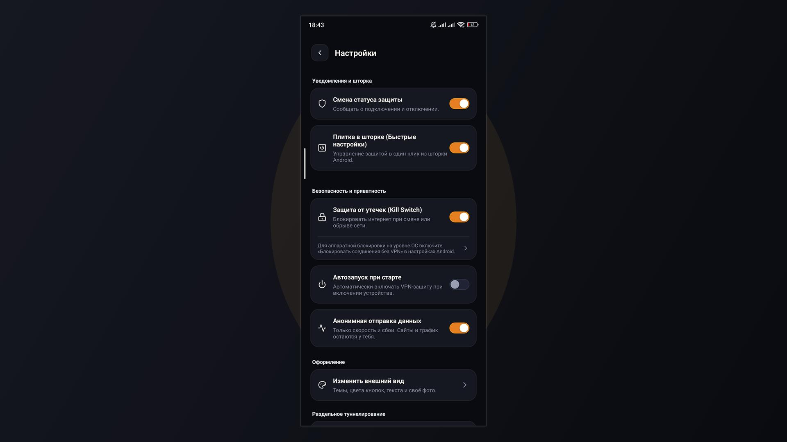
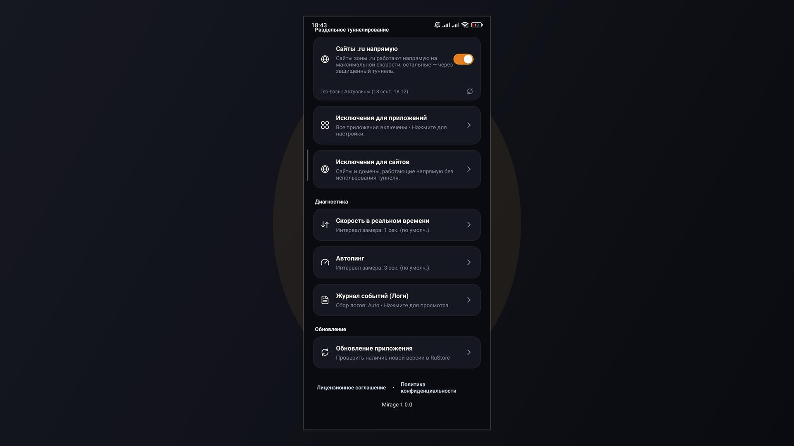
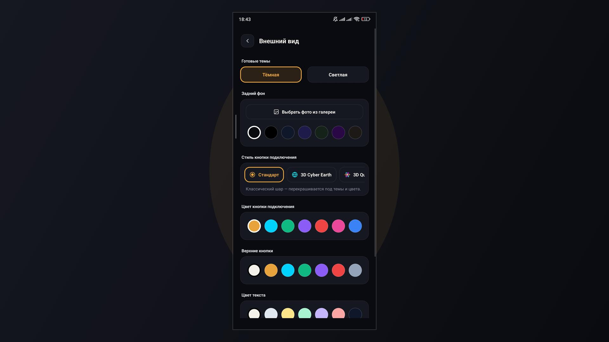
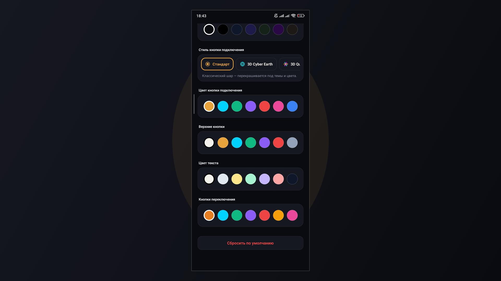
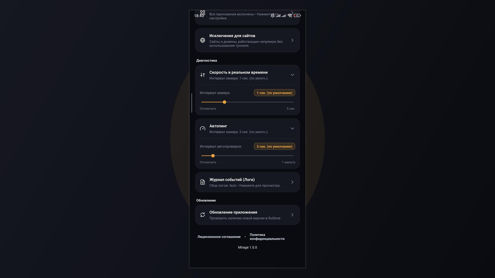
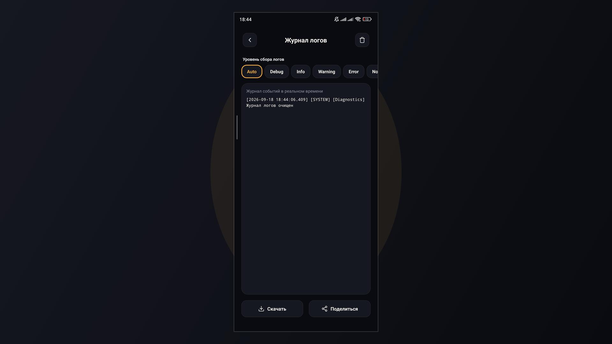

# NAUA Security Mirage (Android)

<p align="center">
  
  <br />
  <strong>Защита интернет-соединения, шифрование трафика и приватность.</strong>
  <br />
  <em>Быстрый и надежный VLESS-клиент для Android нового поколения.</em>
</p>

<p align="center">
  <a href="https://github.com/Core-Dev-Support/naua-security-mirage-android/releases/latest"></a>
  
  
  <a href="LICENSE"></a>
</p>

<p align="center">
  <a href="https://github.com/Core-Dev-Support/naua-security-mirage-android/releases/latest"><b>⬇️ Скачать APK</b></a> •
  <a href="https://www.rustore.ru/catalog/app/com.naua_security_mirage.app"><b>🛒 RuStore</b></a> •
  <a href="https://docs.google.com/document/d/1Q0_MpGF5D1GGoFu2HcdTle0kvLb3S7L52x2XIc47eLw/edit?usp=sharing"><b>📋 Лицензионное соглашение (EULA)</b></a> •
  <a href="https://docs.google.com/document/d/1FrmDpGS3sC_kQYyv1feNO2G2XMQr_ZV4_GAS-Qm4y1I/edit?usp=sharing"><b>🔒 Политика конфиденциальности</b></a>
</p>

---

## 📱 Скриншоты приложения

<p align="center">
  
  
  
  
  
  
  
</p>

---

## 🛡 О проекте

**NAUA Security Mirage** — современный и надежный инструмент для обеспечения конфиденциальности и безопасного сетевого подключения на базе передового протокола VLESS.

Приложение создано для защиты ваших персональных данных, шифрования интернет-трафика в публичных сетях Wi-Fi и обеспечения стабильного скоростного соединения без задержек.

---

## ✨ Ключевые возможности

- 🛡 **Надежное шифрование и безопасность**  
  Весь сетевой трафик надежно защищен с помощью современных алгоритмов шифрования нового поколения, предотвращая перехват данных провайдерами или злоумышленниками в публичных точках доступа.

- 🔒 **Строгая политика No-Logs**  
  Мы уважаем право на приватность: приложение не собирает, не отслеживает и не сохраняет историю посещенных веб-сайтов, DNS-запросы и передаваемый контент.

- ⚡ **Раздельное туннелирование (Per-App Proxy)**  
  Полный контроль над трафиком: выбирайте сами, какие приложения на вашем устройстве должны работать через защищенный туннель, а какие — напрямую через обычную сеть.

- 📊 **Контроль и диагностика в реальном времени**  
  Удобная панель состояния позволяет отслеживать текущую задержку (ping), скорость соединения и время активной сессии. Встроенный тест доступности узлов помогает моментально проверить качество связи.

- 🔔 **Удобное управление из шторки**  
  Информативное системное уведомление позволяет контролировать состояние защиты и подключаться/отключаться в одно касание прямо из шторки Android, не отвлекаясь от текущих дел.

- 🎨 **Чистый интерфейс и адаптивный дизайн**  
  Приложение поддерживает темную и светлую темы оформления с высокой контрастностью, бережно расходует заряд аккумулятора и не перегружено лишними элементами.

- 🚫 **Без рекламы и скрытых платежей**  
  Полноценная и стабильная работа всех функций без навязчивых рекламных баннеров.

> **Защитите свое интернет-соединение с NAUA Security Mirage в один клик!**

---

## ⚙️ Системные требования

- **Операционная система:** Android 8.0 (Oreo) и новее (API Level 26+).
- **Поддерживаемые архитектуры:** `arm64-v8a`, `armeabi-v7a`, `x86_64`, `x86`.
- **Сеть:** Wi-Fi, 3G / 4G LTE / 5G.

---

## 🔬 Принцип работы и архитектура

1. **Транспортный уровень VLESS + Reality:**  
   Использует современное прямое шифрование потока без избыточных заголовков. Маскировка под стандартные HTTPS сессии минимизирует задержки (ping) и обеспечивает максимальную пропускную способность.
2. **Защита от утечек DNS (DNS Leak Protection):**  
   Все DNS-запросы маршрутизируются исключительно внутри шифрованного туннеля через защищенные DNS-серверы, исключая возможность перехвата провайдером.
3. **Криптографическая защита целостности (Self-Healing Integrity):**  
   Алгоритм расшифровки рабочей сетевой конфигурации динамически валидирует SHA-256 цифровой подписи установленного пакета (`mirage-release.jks`). Любая попытка модификации или несанкционированной переподписи APK приводит к невозможности расшифровки конфигурации.

---

## 📁 Состав проекта

| Компонент | Назначение |
| :--- | :--- |
| `app/` | Исходный код Android-приложения (Kotlin, Jetpack Compose, Material 3, Android VpnService) |
| `app/src/main/cpp/` | Нативный слой JNI и высокопроизводительные библиотеки туннелирования |
| `docs/screenshots/` | Графические материалы и скриншоты интерфейса |
| `.github/workflows/` | CI/CD автоматизация облачной сборки и подписи релизов в GitHub Actions |

---

## 🔨 Сборка из исходных текстов

Для сборки проекта требуются **JDK 17** и **Android SDK (API 34+)**:

```bash
# Сборка отладочной версии
./gradlew assembleDebug

# Сборка релизной версии с оптимизацией R8/ProGuard
./gradlew assembleRelease
```

---

## ⚖️ Правовая информация

**NAUA Security Mirage** — программное средство для защиты и шифрования сетевого трафика на устройстве пользователя.

- Программа не размещает, не хранит и не распространяет запрещенную информацию.
- Программа предназначена для законной защиты конфиденциальности, персональных данных и защиты от перехвата информации в незащищенных сетях связи (публичный Wi-Fi).
- Пользователь обязуется использовать приложение в строгом соответствии с действующим законодательством своей юрисдикции.

### Юридические документы:
- 📋 [Лицензионное соглашение конечного пользователя (EULA)](https://docs.google.com/document/d/1Q0_MpGF5D1GGoFu2HcdTle0kvLb3S7L52x2XIc47eLw/edit?usp=sharing)
- 🔒 [Политика конфиденциальности (Privacy Policy)](https://docs.google.com/document/d/1FrmDpGS3sC_kQYyv1feNO2G2XMQr_ZV4_GAS-Qm4y1I/edit?usp=sharing)

---

## 📜 Лицензия

Исходный код опубликован для ознакомления, тестирования и независимого аудита безопасности.  
Все права на бренд **NAUA Security Mirage**, дизайн, графику и исходный код принадлежат разработчику (**Core Dev Support**).

Запрещается несанкционированное коммерческое распространение, переупаковка, декомпиляция в коммерческих целях или публикация копий приложения в каталогах приложений без предварительного письменного согласия правообладателя.  
Полные условия см. в файле [LICENSE](LICENSE).

---

<p align="center">
  <b>Разработчик:</b> Core Dev Support • <b>Email:</b> <a href="mailto:coredevsupport@gmail.com">coredevsupport@gmail.com</a>
</p>
