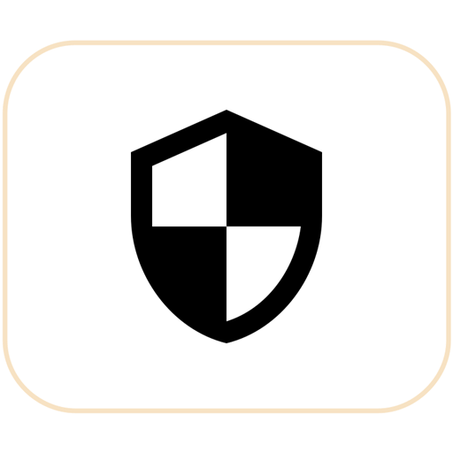
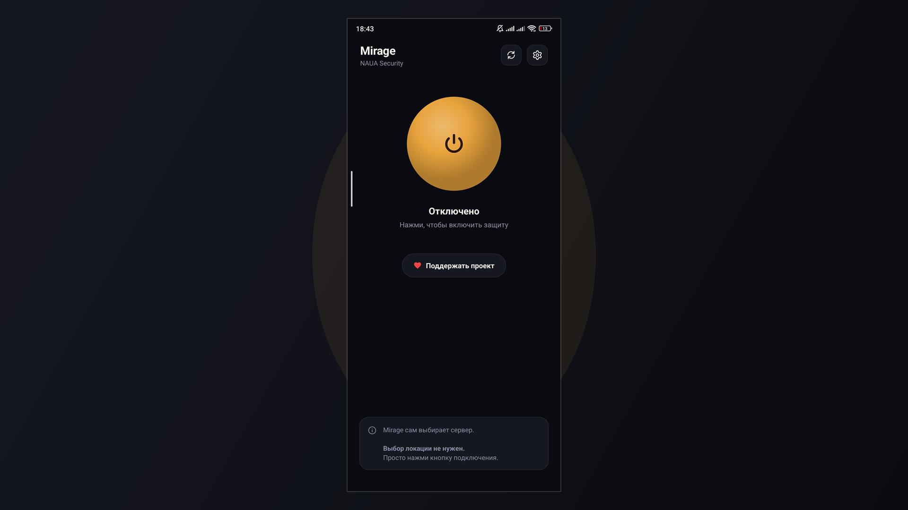
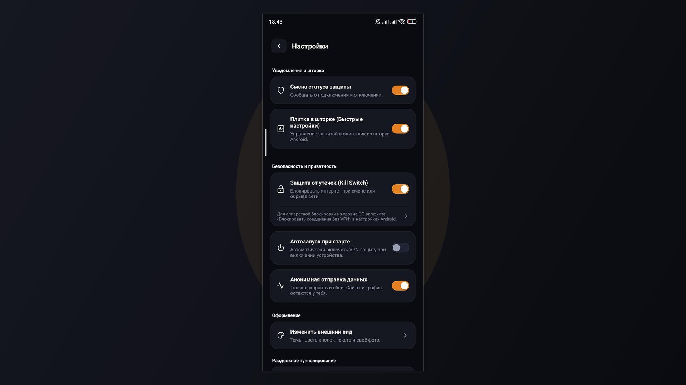
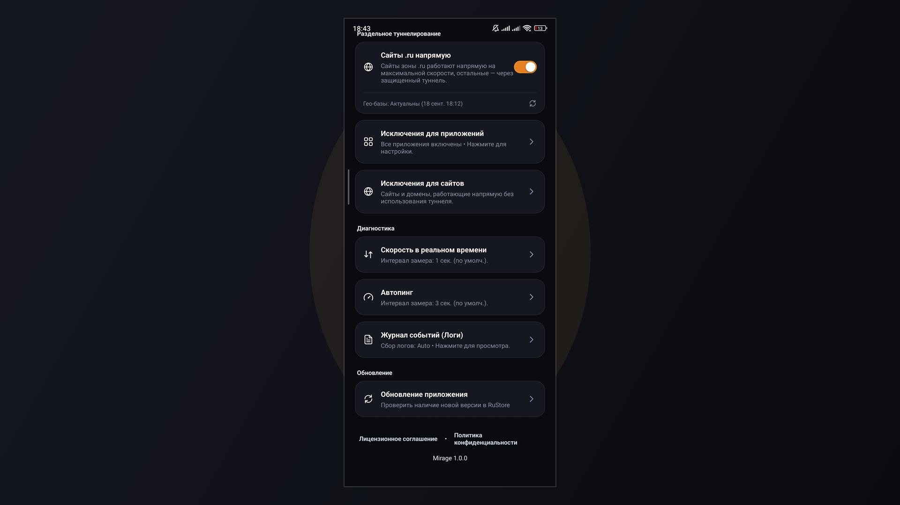
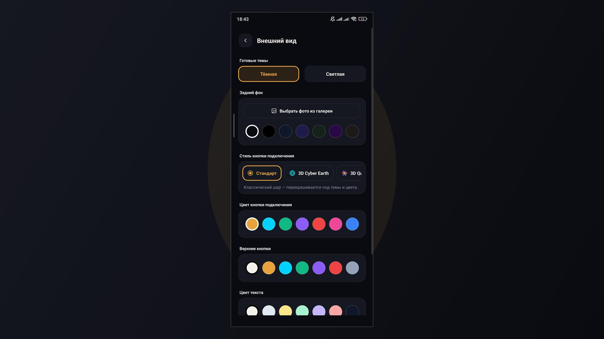
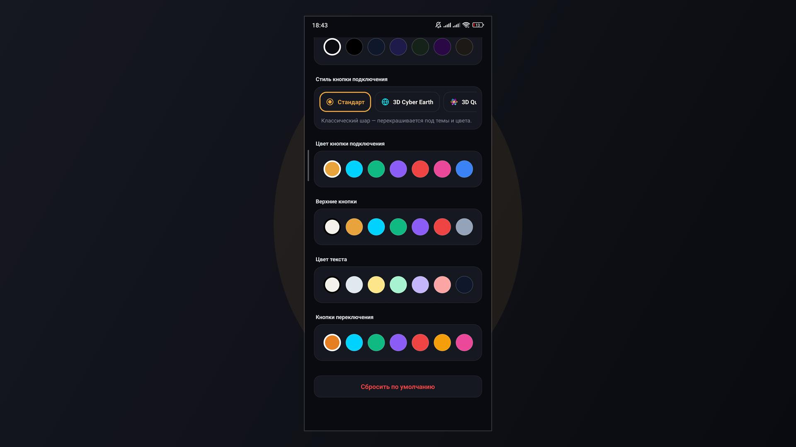
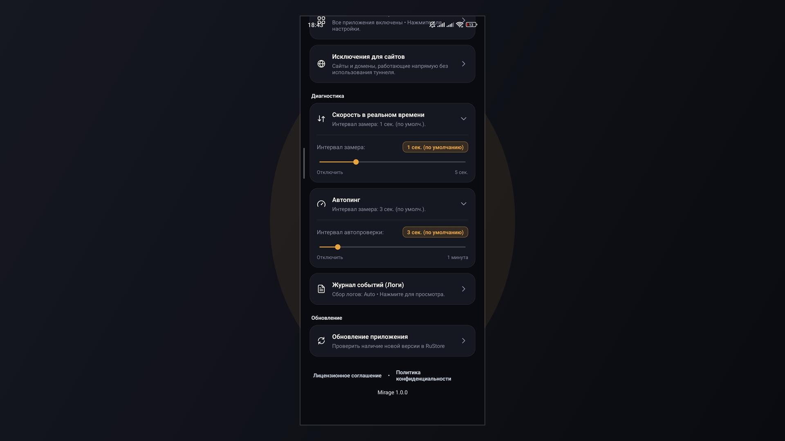
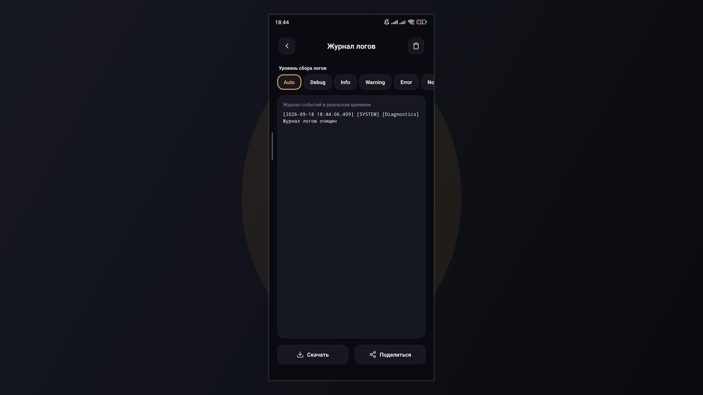
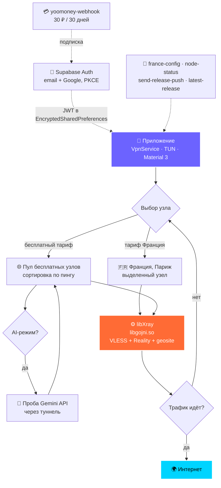

<p align="center">
  
</p>

<p align="center">
  
</p>

<p align="center">
  <b>Нативный Android-VPN на VLESS + Reality: трафик неотличим от обычного HTTPS, туннель поднимается в один тап, рекламы в приложении нет вообще.</b>
</p>

<p align="center">
  <a href="https://github.com/Core-Dev-Support/naua-security-mirage-android/releases/latest"></a>
  <a href="https://github.com/Core-Dev-Support/naua-security-mirage-android/actions/workflows/build-release.yml"></a>
  
  
</p>

<p align="center">
  
  
  
  
  
  
  
</p>

<p align="center">
  <a href="https://github.com/Core-Dev-Support/naua-security-mirage-android/releases/latest"></a>
  &nbsp;&nbsp;
  <a href="https://t.me/News_And_Updates_Apps"></a>
  &nbsp;&nbsp;
  <a href="README_EN.md"></a>
</p>

<p align="center">
  <sub>Последний релиз: <b>v1.3.0</b> · ветка <code>main</code> готовит <b>v1.4.0</b> · Android 6.0+ · <code>arm64-v8a</code> / <code>armeabi-v7a</code></sub>
</p>

---

## Что внутри

Одна большая кнопка — и туннель поднят. Локацию выбирать не нужно: клиент сам замеряет пинг до всех доступных узлов, поднимает ядро Xray на лучшем и проверяет, что трафик реально идёт, а не просто «ядро стартовало». Если выбранный узел не тянет — происходит автоматический переход на следующий.

**🛡 Маскировка.** VLESS + Reality: соединение неотличимо от обычной TLS-сессии к популярному сайту, поэтому переживает DPI там, где падают протоколы с узнаваемыми сигнатурами.

**🤖 AI-режим** · *v1.4.0*. Кандидатный узел проверяется запросом к Gemini API через поднятый туннель: страна выхода сама по себе не значит, что Google реально отвечает.

**⚡ Split-tunneling.** Per-App Proxy, свои домены напрямую, весь `.ru` мимо туннеля на полной скорости.

**🧭 Безопасный старт.** Приложение не запускается на подменённой подписи, root-устройстве, эмуляторе, с подключённым отладчиком или с Frida.

**🔒 DNS внутри туннеля.** Плюс карточка-предупреждение, если системный «Частный DNS» ломает маршрутизацию.

**🔄 Обновление внутри приложения.** Скачивание и установка с обязательной проверкой подписи v2/v3 — чужая подпись отменяет установку.

**📴 Защита экрана.** `FLAG_SECURE`, плюс диалог с объяснением риска, если снять скриншот всё же нужно.

**🧩 Своя панель настроек.** Темы, 5 стилей кнопки, анимации, скрытие и перестановка разделов, русский и английский.

---

## 📱 Экраны

<p align="center">
  <table>
    <tr>
      <td align="center"><br /><sub><b>Главный экран</b><br />подключение и статус</sub></td>
      <td align="center"><br /><sub><b>Настройки</b><br />шторка · Kill Switch · автозапуск</sub></td>
      <td align="center"><br /><sub><b>Split-tunneling</b><br />.ru · приложения · сайты</sub></td>
      <td align="center"><br /><sub><b>Внешний вид</b><br />темы · фон · стиль кнопки</sub></td>
    </tr>
    <tr>
      <td align="center"><br /><sub><b>Цвета</b><br />кнопка · текст · переключатели</sub></td>
      <td align="center"><br /><sub><b>Диагностика</b><br />скорость · автопинг · узлы</sub></td>
      <td align="center"><br /><sub><b>Журнал</b><br />уровни · экспорт · шаринг</sub></td>
      <td align="center"><b>407 строк</b><br /><sub>русский и английский,<br />переключаются на лету</sub></td>
    </tr>
  </table>
</p>

---

## 🔬 Как это работает


```mermaid
flowchart TD
    A["📱 Приложение<br/>VpnService · TUN · Material 3"] --> S{"Выбор узла"}
    S -->|"тариф Франция"| P["🇫🇷 Франция, Париж<br/>выделенный узел"]
    S -->|"бесплатный тариф"| F["🌐 Пул бесплатных узлов<br/>сортировка по пингу"]
    F --> AI{"AI-режим?"}
    AI -->|да| GP["🤖 Проба Gemini API<br/>через туннель"]
    GP --> F
    P --> C["⚙️ libXray<br/>libgojni.so<br/>VLESS + Reality + geosite"]
    F --> C
    C --> W{"Трафик идёт?"}
    W -->|нет| S
    W -->|да| N["🌍 Интернет"]

    G["👤 Supabase Auth<br/>email + Google, PKCE"] -.->|JWT в EncryptedSharedPreferences| A
    Y["💳 yoomoney-webhook<br/>30 ₽ / 30 дней"] -.->|подписка| G
    B["📡 france-config · node-status<br/>send-release-push · latest-release"] -.-> A

    style A fill:#6C63FF,stroke:#fff,stroke-width:2px,color:#fff
    style C fill:#FF6B35,stroke:#fff,stroke-width:2px,color:#fff
    style N fill:#00D4FF,stroke:#fff,stroke-width:2px,color:#000
```

1. **Выбор узла.** Замеряется пинг до всех кандидатов, ядро поднимается на лучшем, затем проверяется фактический проход трафика. Не прошёл — берётся следующий узел.
2. **AI-режим** *(v1.4.0)*. Дополнительно выполняется запрос к Gemini API через поднятый туннель. Узел, который не даёт реального доступа к Google, отбрасывается независимо от страны выхода.
3. **Целостность.** При старте сверяется SHA-256 сертификата подписи APK с зашитым в код значением; проверяются отладчик, трассировка, хук-фреймворки, Frida, root и эмулятор.
4. **Маршрутизация.** DNS-запросы идут внутри туннеля, `geosite.dat` разводит `.ru` и пользовательские домены напрямую.
5. **Контроль.** Скорость, пинг и время сессии — на экране и в уведомлении; состояние платного узла и история сбоев — в карточке диагностики; фоновые воркеры проверяют обновления, подписку и доступность узла.

Подробности: [docs/ARCHITECTURE.md](docs/ARCHITECTURE.md).

---

## 🧱 Стек

<p align="center">
  
  
  
  
  
  
  
  
  
</p>

- **Клиент** — Kotlin, `VpnService` (TUN, `specialUse` FGS), 2 Quick Settings Tile, WorkManager, OkHttp, `EncryptedSharedPreferences`.
- **Ядро** — Xray (`libgojni.so`, `arm64-v8a` + `armeabi-v7a`), VLESS + Reality, `geosite.dat` в assets с обновлением из приложения.
- **Бэкенд** — Supabase Auth (email + Google, PKCE) и 6 Edge-функций на Deno: `france-config`, `latest-release`, `node-status`, `register-device`, `send-release-push`, `yoomoney-webhook`.
- **CI/CD** — secret-scan → `deno check` и `deno test` → 9 юнит-тестов → сборка с R8 → проверка манифеста на рекламные идентификаторы → требование подписи v2/v3.

---

## 🚀 Установка

1. Открой [**Releases → Latest**](https://github.com/Core-Dev-Support/naua-security-mirage-android/releases/latest).
2. Скачай `NAUA-Security-Mirage-v1.3.0.apk` (≈ 28 МБ).
3. Разреши установку из неизвестных источников и поставь приложение.
4. Нажми большую кнопку.

**Требования:** Android 6.0+ (API 23), процессор `arm64-v8a` или `armeabi-v7a`, любой интернет.

<details>
<summary><b>Подписка на выделенный узел во Франции</b></summary>

Войди через email или Google, затем «Оплатить через ЮMoney» — **30 ₽ за 30 дней**. Разовая оплата, автосписаний нет. Узел активируется в течение 1–2 минут. Подписка привязана к аккаунту, а не к устройству.

</details>

<details>
<summary><b>Как проверить, что туннель действительно работает</b></summary>

В приложении есть карточка узлов с проверкой «отвечают N из M», история сбоев платного узла и live-панель скорости. Независимая проверка: открой в браузере [ipleak.net](https://ipleak.net) или [dnsleaktest.com](https://dnsleaktest.com) при активном VPN — должен показаться IP и DNS узла, а не провайдера.

</details>

---

## 🔨 Сборка из исходников

Нужны **JDK 17** и **Android SDK (API 34+)**:

```bash
git clone https://github.com/Core-Dev-Support/naua-security-mirage-android.git
cd naua-security-mirage-android

./gradlew assembleDebug          # отладочная сборка
./gradlew testDebugUnitTest      # юнит-тесты
./gradlew assembleRelease        # релизная сборка с R8
```

Секреты (`SUPABASE_URL`, `FRANCE_*`, `YOOMONEY_WALLET` и прочие) читаются из `local.properties`, переменных окружения или Gradle-свойств и **никогда не попадают в код**. Ключ подписи — `mirage-release.jks`. Файлы `*.jks`, `key.properties`, `google-services.json`, `local.properties` в репозиторий не коммитятся.

CI собирает подписанный APK, сверяет SHA-256 файлов релиза, требует подпись v2 или v3, проверяет, что в итоговом манифесте нет `AD_ID` и рекламных разрешений, и только после этого публикует Release.

---

## 📁 Структура

```
naua-security-mirage-android/
├── app/                     Android-клиент
│   └── src/main/
│       ├── java/com/naua_security_mirage/app/
│       │   ├── ui/          MainActivity, адаптеры, кастомные вьюхи
│       │   ├── vpn/         MirageVpnService, XrayVpnController, тайлы
│       │   ├── data/        Supabase, репозитории, модели
│       │   ├── util/        AppShield, обновления, логи, анимации
│       │   ├── work/        WorkManager: узел, подписка, обновления
│       │   └── push/        FCM-приёмник
│       ├── jniLibs/         libgojni.so — arm64-v8a, armeabi-v7a
│       ├── assets/geo/      geosite.dat
│       └── test/            9 юнит-тестов
├── desktop/                 Клиент на Compose Multiplatform (в разработке)
├── supabase/functions/      6 Edge-функций на Deno
├── docs/                    Архитектура, релизы, правовые документы, скриншоты
└── .github/workflows/       build-release, secret-scan, live-check, build-desktop
```

---

## 🛡 Безопасность и приватность

- **Никаких логов трафика.** Адреса сайтов, DNS-запросы и содержимое пакетов не собираются и не хранятся.
- **Минимум разрешений.** Нет `QUERY_ALL_PACKAGES` — список приложений берётся точечными `<queries>`. `AD_ID`, `ACCESS_ADSERVICES_*` и реферальный сервис вырезаны из манифеста, CI это проверяет перед публикацией.
- **Токены** — в `EncryptedSharedPreferences`, бэкап приложения запрещён (`allowBackup=false`), cleartext-трафик запрещён (`usesCleartextTraffic=false`).
- **Контур самозащиты.** При старте проверяется подпись APK, отладчик, `TracerPid`, хук-фреймворки, Frida, root и эмулятор. Подделанная сборка не запускается.
- **Обновления** — только с совпадающей подписью v2/v3.
- **Телеметрия** — анонимные краши и статистика Firebase, отключается одним переключателем в настройках; содержимое трафика не отправляется никогда.
- **Секретов в репозитории нет.** CI падает, если в исходниках найдены хост, пароль или ключ.

Нашли уязвимость — не создавайте публичный issue, см. [SECURITY.md](SECURITY.md).

---

## 📋 Релизы

| Версия | Статус | Что внутри |
| :--- | :--- | :--- |
| **v1.4.0** | в разработке | AI-режим с пробой Gemini · анимации в настройках · скрытие и перестановка разделов · уведомления об оплате и плитка · донат через CloudTips и Tribute · журнал сбоев узла |
| **v1.3.0** | релиз | Вход через Google · подписка ЮMoney 30 ₽ · выделенный узел во Франции · защита экрана · логи туннеля · починка бесплатного режима (DNS) |

Заметки к релизам: [docs/releases/](docs/releases/). Полная история: [CHANGELOG.md](CHANGELOG.md). Планы: [ROADMAP.md](ROADMAP.md).

---

## ❓ Вопросы

<details>
<summary><b>Это бесплатно?</b></summary>

Да, есть бесплатный режим на пуле бесплатных узлов. Выделенный узел во Франции — разовые **30 ₽ за 30 дней**, без автосписаний.

</details>

<details>
<summary><b>Что за AI-режим?</b></summary>

Режим подбора узла, который проверяет **реальный ответ Google** через сам туннель, а не доверяет стране выхода. Если ни один узел не подошёл, приложение честно скажет об этом, а не подключится вслепую.

</details>

<details>
<summary><b>Почему банки и Госуслуги работают и без VPN?</b></summary>

Split-tunneling: `.ru`-сайты и выбранные тобой приложения и домены идут напрямую, остальное — через туннель.

</details>

<details>
<summary><b>Что вы видите?</b></summary>

Ни URL, ни DNS, ни содержимое трафика. Строгий No-Logs на уровне приложения, рекламный идентификатор вырезан из манифеста.

</details>

<details>
<summary><b>Почему Android просит отключить другой VPN?</b></summary>

Система разрешает только один активный VPN одновременно. Это ограничение Android, а не приложения.

</details>

<details>
<summary><b>Будет ли в магазинах?</b></summary>

Сейчас — GitHub Releases, откуда обновление ставится прямо из приложения с проверкой подписи. Uptodown проходит модерацию.

</details>

---

## 🤝 Участие

- ⭐ Поставь звезду — это лучшая поддержка проекта.
- 🐛 Баг — [bug report](https://github.com/Core-Dev-Support/naua-security-mirage-android/issues/new/choose).
- 💡 Идея — [feature request](https://github.com/Core-Dev-Support/naua-security-mirage-android/issues/new/choose).
- 🔧 Код — [CONTRIBUTING.md](CONTRIBUTING.md), шаблоны PR и issue уже настроены.
- 📣 [Telegram-канал с обновлениями](https://t.me/News_And_Updates_Apps).

---

## 📜 Лицензия

Исходники открыты для ознакомления, тестирования и **независимого аудита безопасности**. Права на бренд **NAUA Security Mirage**, дизайн, графику и код принадлежат **Core Dev Support**. Полный текст — [LICENSE](LICENSE).

<p align="center">
  <a href="https://github.com/Core-Dev-Support/naua-security-mirage-android/releases/latest"><b>⬇️ Скачать APK</b></a>
  &nbsp;•&nbsp;
  <a href="mailto:coredevsupport@gmail.com">coredevsupport@gmail.com</a>
  &nbsp;•&nbsp;
  <a href="https://t.me/News_And_Updates_Apps">Telegram</a>
</p>